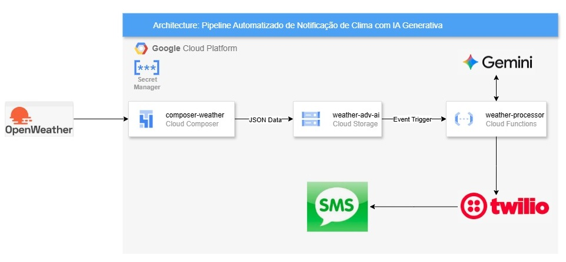
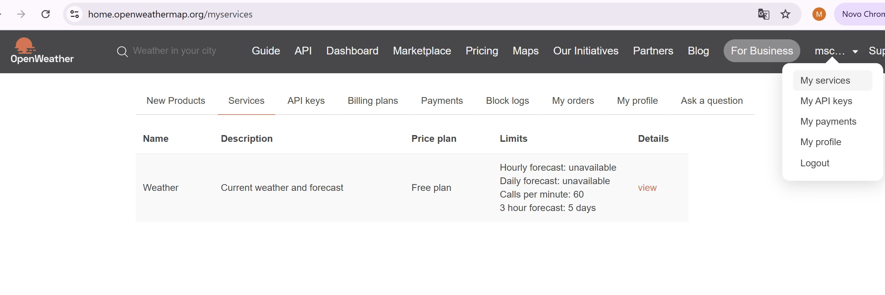
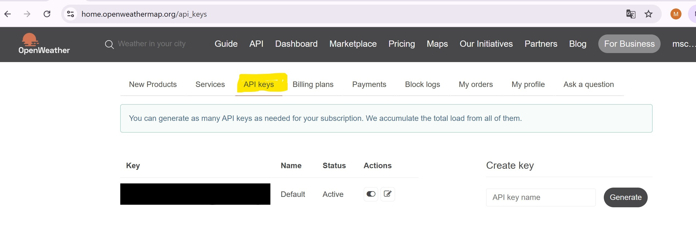
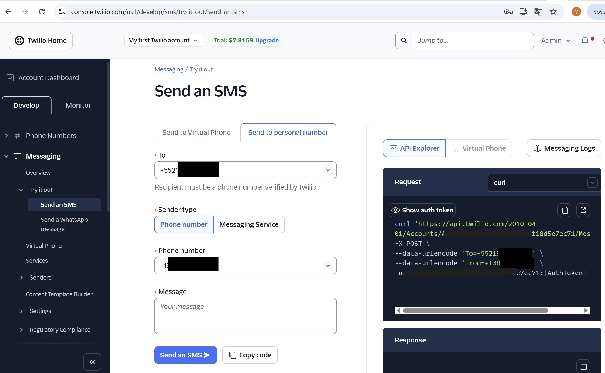
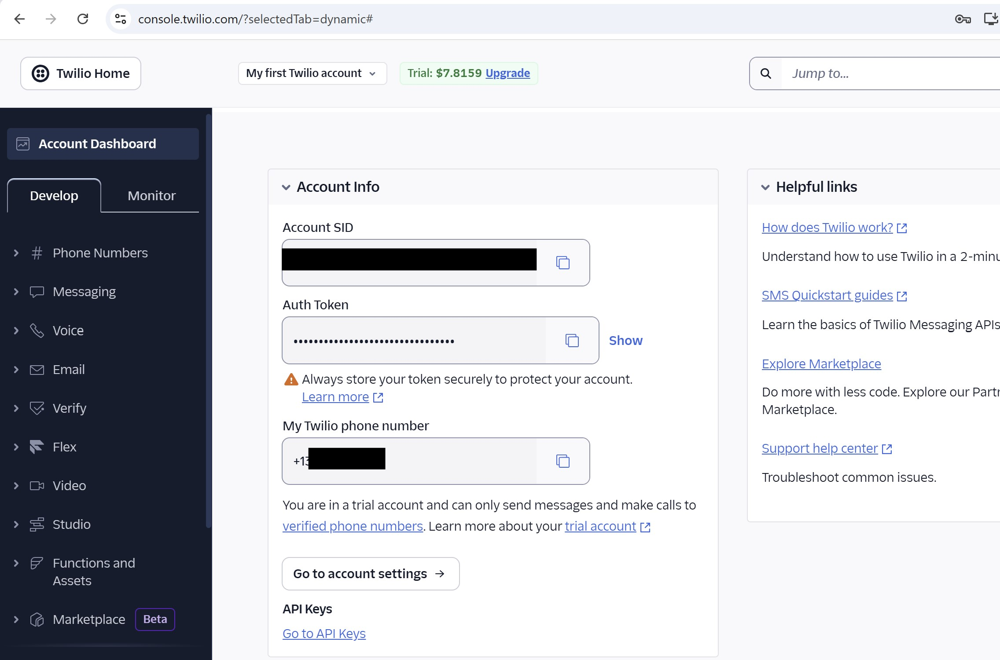
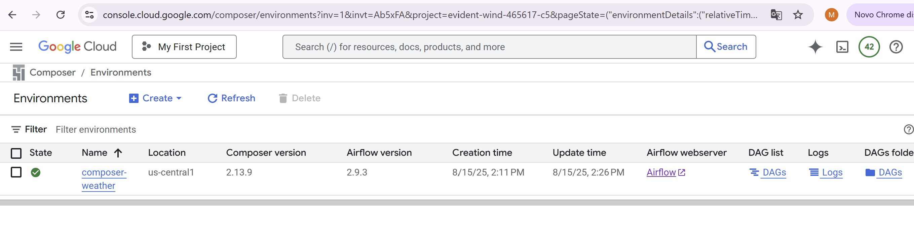
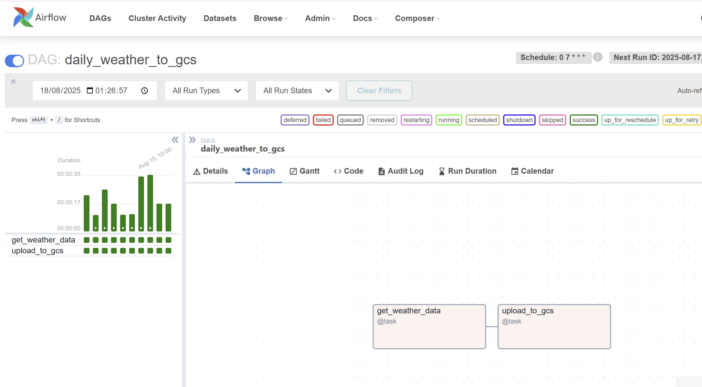
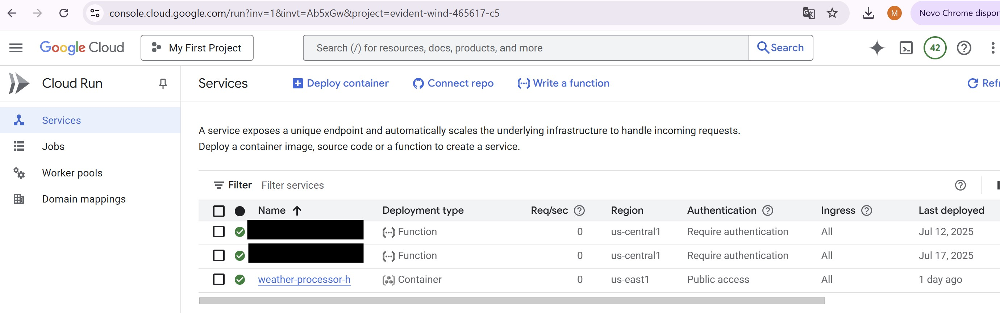
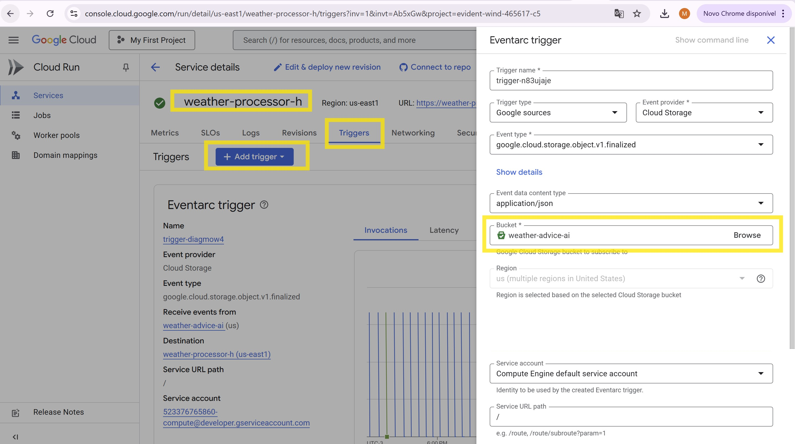
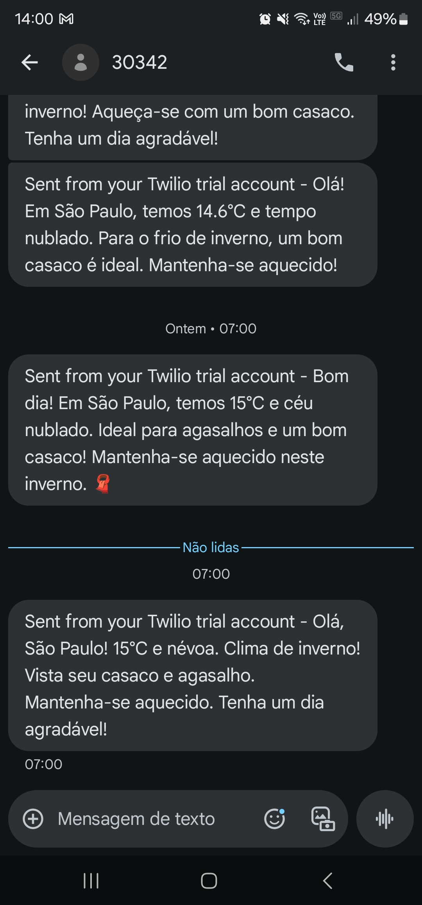

# Pipeline Automatizado de Notificação de Clima com IA Generativa

Decidi construir essa aplicação/POC para minha ida a São Paulo pois gostaria de monitorar todas as manhãs como estava o clima/tempo logo ao acordar. 
Este projeto implementa um pipeline de dados e IA totalmente automatizado e sem servidor no Google Cloud Platform (GCP). O objetivo é buscar a previsão do tempo diária para uma cidade, usar um modelo de IA generativa (Gemini) para criar um resumo criativo e uma sugestão de roupa, e enviar essa mensagem para um celular via SMS.

# Arquitetura

O fluxo de trabalho é orquestrado por diversos serviços gerenciados do GCP, seguindo uma arquitetura orientada a eventos, o que a torna robusta e escalável.

    Etapa 1: Orquestração e Ingestão Diária
        Composer["🗓️ Cloud Composer (Agenda a tarefa para 7h)"]
        PyOperator["🐍 PythonOperator(Busca dados e formata)"]
        GCS[("🪣 Cloud Storage(Armazena o arquivo .json)")]
    
    Etapa 2: Processamento Reativo com IA
        Eventarc{"⚡ Eventarc(Detecta novo arquivo)"}
        CloudRun["🏃 Cloud Run(Serviço de processamento)"]
        VertexAI["🤖 Vertex AI(Modelo Gemini 2.5 Flash)"]
    
    Fontes e Destinos Externos
        OpenWeatherAPI["🌍 OpenWeatherMap API"]
        TwilioAPI["📱 Twilio API"]
        UserDevice(📱 Usuário Final)
    
    %% Define o fluxo com o rótulo detalhado
    Composer -- "Executa a DAG" --> PyOperator;
    OpenWeatherAPI -- "1. Fornece dados brutos do tempo" --> PyOperator;
    PyOperator -- "2. Salva o arquivo sao_paulo_YYYYMMDD.json" --> GCS;
    GCS -- "3. Emite evento 'object.finalized'" --> Eventarc;
    Eventarc -- "4. Aciona o serviço com o evento" --> CloudRun;
    CloudRun -- "5. Lê o JSON do GCS" --> CloudRun;
    CloudRun -- "6. Envia prompt com os dados" --> VertexAI;
    VertexAI -- "7. Gera resumo e sugestão" --> CloudRun;
    CloudRun -- "8. Envia texto para o SMS" --> TwilioAPI;
    TwilioAPI -- "9. Entrega a mensagem" --> UserDevice;

<b>Componentes</b>

- **OpenWeatherMap API**: Fonte externa que fornece os dados meteorológicos brutos em formato JSON.

- **Cloud Composer**: Orquestrador de workflows (baseado em Apache Airflow) que agenda e executa a tarefa de ingestão de dados pontualmente todos os dias.

- **Google Cloud Storage (GCS)**: Armazena os arquivos JSON com os dados do tempo, servindo como um ponto de desacoplamento entre a ingestão e o processamento.

- **Eventarc**: Serviço de mensagens que "escuta" por eventos no GCP. Neste caso, ele detecta a criação de um novo arquivo no bucket GCS e aciona o Cloud Run.

- **Cloud Run**: Plataforma de computação sem servidor que hospeda nossa aplicação principal. O serviço é responsável por ler os dados, chamar o modelo de IA e enviar o SMS.

- **Vertex AI (Gemini 2.5 Flash)**: A plataforma de IA do Google. Usamos a API do modelo Gemini para interpretar os dados meteorológicos e gerar um texto criativo e útil.

- **Twilio API**: Serviço externo utilizado para enviar a mensagem de texto (SMS) para o celular do usuário final. 

<b>Como Funciona o Fluxo</b> 
1. Agendamento: Todos os dias, às 7:00 da manhã, o Cloud Composer executa uma DAG (workflow).

2. Ingestão: A DAG executa uma tarefa Python que chama a API do OpenWeatherMap para a cidade de São Paulo.

3. Armazenamento: A tarefa salva a resposta JSON em um arquivo com o formato sao_paulo_YYYYMMDD.json em um bucket do Google Cloud Storage.

4. Gatilho: A criação deste novo arquivo no bucket emite um evento. O Eventarc, que está monitorando o bucket, captura este evento.

5. Execução: O Eventarc aciona o serviço Cloud Run, enviando as informações sobre o arquivo recém-criado.

6. Processamento: O serviço Cloud Run é ativado, lê o conteúdo do arquivo JSON do GCS.

7. Inteligência Artificial: O serviço monta um prompt com os dados do tempo e envia para o modelo Gemini no Vertex AI, pedindo um resumo criativo para SMS.

8. Notificação: O Cloud Run recebe o texto gerado pelo Gemini e usa a API da Twilio para enviá-lo como um SMS para o número de telefone pré-configurado.

 

# API OpenWeather

OpenWeatherMap é uma plataforma online que oferece serviços de dados meteorológicos em tempo real e previsões do tempo por meio de APIs. Para criar uma API key (Free Plan) é muito simples, basta você acessar e se cadastrar no endereço [https://openweathermap.org](https://openweathermap.org)  que logo em seguida você receberá um email contendo a sua chave API para utilizar. 
Acessando o site, você também tem acesso a sua chave API, documentação e diversos exemplos para apoio. 

 

# Twilio

A Twilio oferece APIs que permitem que os desenvolvedores incorporem funcionalidades de comunicação em seus aplicativos variedade de canais de comunicação, incluindo SMS, voz, vídeo e bate-papo, WhatsApp etc.
E para criar uma API Key também é muito simples, basta você acessar acessar o site https://www.twilio.com/ se cadastrar e "comprar" um Twilio Virtual Phone number. Fique tranquilo pois o plano gratuito disponibiliza crédito suficiente para brincar na ferramenta. 
  
Para testar o envio de SMS acesse o Messaging -> Try it out -> Send an SMS. Digite seu número de telefone em TO e escolha o número de telefone Twilio fornecido. A tela abaixo mostra o exemplo para testar o envio de SMS. 

Para adquirir seua Account SID e Auth Token, que será utilizado no Python para a chamada do serviço de envio de SMS. Acesse o link Account Dashboard e logo abaixo você verá as informações de Account SID e Auth Token. Guardeas em um local seguro. 

 

# Componentes do Projeto

1. Cloud Composer 

Crie um novo ambiente Composer 2 Airflow 2, em seguida faça o upload do arquivo <b>weather_ingestion_dag.py</b> para a pasta <b>/dags,</b>. Este script define o workflow que roda diariamente para buscar os dados e salvá-los no GCS. 

2. Cloud Run Service (weather-processor)

Este serviço contém a lógica principal de IA e notificação.

- Crie uma pasta pelo Cloud Shell
- Transfira os seguintes arquivos para essa pasta: main.py, requirements.txt e Dockerfile 
- Construa a imagem do contêiner: gcloud builds submit --tag gcr.io/[PROJECT_ID]/weather-processor
- Faça o deploy do serviço: gcloud run deploy weather-processor --image gcr.io/[PROJECT_ID]/weather-processor

    Crie um Eventarc/Trigger, conforme tela abaixo

 

# Configuração e Pré-requisitos

1. Contas de Serviço: Certifique-se de ter contas da OpenWeatherMap e Twilio.

2. Projeto GCP: Crie um projeto no Google Cloud e ative as APIs para: Cloud Composer, Cloud Storage, Eventarc, Cloud Run, Vertex AI e Secret Manager.

3. Cloud Storage: Crie um bucket para armazenar os arquivos de clima.

4. Secret Manager: Crie segredos para todas as suas chaves e credenciais:
    - OPENWEATHER_API_KEY

    - TWILIO_ACCOUNT_SID

    - TWILIO_AUTH_TOKEN

    - TWILIO_FROM_NUMBER

    - TWILIO_TO_NUMBER

 
Com todos os componentes configurados, o pipeline será executado automaticamente todos os dias, entregando uma previsão do tempo inteligente diretamente no seu celular.

 

# SMS

